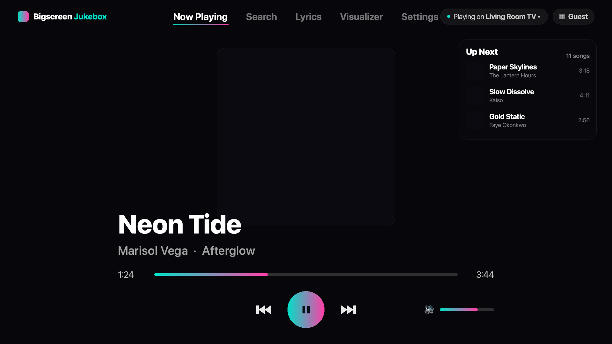
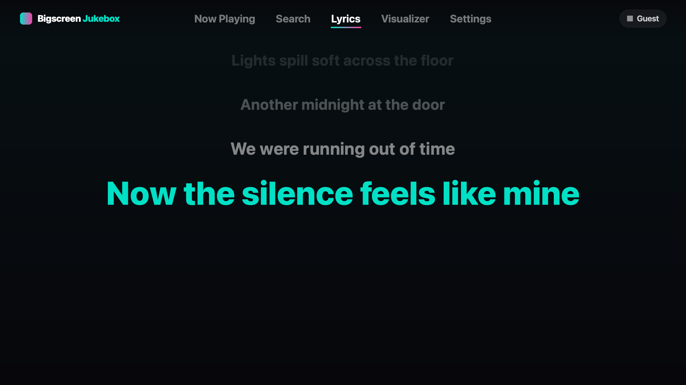
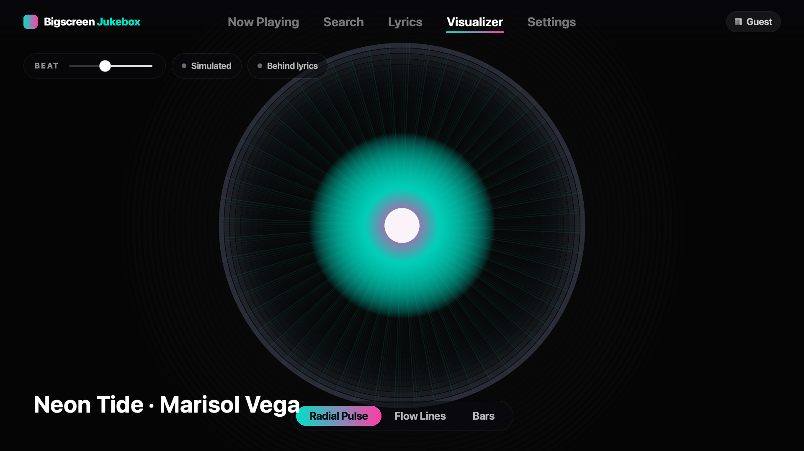

# Bigscreen Jukebox

A fullscreen, TV- and remote-friendly client for a [Music Assistant](https://www.music-assistant.io/)
server — Now Playing, search, karaoke lyrics, an audio visualizer, and a guest QR
mode, all driveable with a D-pad remote. Built with PySide6 / QML.

> Unofficial, third-party client. Not affiliated with the Music Assistant project.



| Lyrics | Visualizer |
|---|---|
|  |  |

## Features

- **Now Playing** — album art (pumps with the bass), transport, volume, an Up Next queue
- **Search** — search your Music Assistant providers and play instantly
- **Lyrics** — smooth-scrolling karaoke lyrics, with an LRCLIB fallback when MA has none
- **Visualizer** — radial / flow / bars, reacting to live audio (PipeWire), optionally behind the lyrics
- **Guest mode** — a corner QR code; prefers the MA **party** plugin (works off-network, rate-limited), falls back to a built-in LAN guest server
- **D-pad navigation** + a settings screen; authored at 1920×1080 and scaled to any display (4K-ready)

## Download

Grab the latest from the [Releases page](https://github.com/shreyasajj/music-assistant-desktop-tv/releases)
(full releases from `main`, pre-releases from `dev`):

- **AppImage** — `chmod +x Bigscreen_Jukebox-x86_64.AppImage` and run it (KDE Plasma & most Linux desktops).
- **Tarball** — extract and run `bigscreen-jukebox/bigscreen-jukebox`.

For the live visualizer / art-pump, install `libportaudio2` (optional). **First run:**
open **Settings**, enter your Music Assistant host + long-lived token, and pick a default player.

## Project structure

```
src/bigscreen_jukebox/      Python backend
  __main__.py     entry point: qasync loop, context objects, QML engine, Settings/Guest controllers
  config.py       Settings dataclass + JSON load/save (~/.config/bigscreen-jukebox/settings.json)
  ma_client.py    MaClient — bridges the Music Assistant websocket client to QML (properties/signals)
  audio_analysis.py  AudioAnalyzer — FFT energy/beat/64-bars; PipeWire monitor capture
  lyrics.py       LRC parsing            lrclib.py   LRCLIB lyric fetch (fallback)
  guest_server.py embedded LAN guest web server (fallback for the party plugin)
  qr.py           QR code -> PNG data URI

qml/                        QML/Quick UI (loaded by the engine)
  main.qml        app shell: 1920x1080 stage + scaling, D-pad nav, screen stack
  TopBar / NowPlaying / Search / Lyrics / Visualizer / SettingsView / UpNextQueue / PlayerMenu / GuestOverlay
  VizCanvas.qml   visualizer drawing engine (radial/flow/bars), reused on the viz tab and behind lyrics
  Theme.qml       color/size tokens (singleton)     VizState.qml  shared viz mode/beat (singleton)
  qmldir          registers the singletons

tests/                      pytest suite (Music Assistant fully mocked — no live server needed)
scripts/screenshots.py      headless render of the UI -> PNGs / QML sanity check (no display, no server)
flatpak/                    Flatpak manifest + AppStream metadata for Flathub (see flatpak/README.md)
bigscreen-jukebox/          the canonical web design prototype (binding visual spec)
.github/workflows/          CI: test, build (PyInstaller + AppImage), publish a release on push
```

### How it fits together

`__main__.py` starts a Qt app on a [qasync](https://github.com/CabbageDevelopment/qasync)
event loop, constructs the backend objects, and exposes them to QML as **context properties**:
`maClient`, `audioAnalyzer`, `guestController`, `settingsController` (plus the `Theme` and
`VizState` QML singletons). `MaClient` connects to the Music Assistant server over its
websocket API, maps player/queue state into Qt properties, and emits change signals; the QML
binds to those. UI lives entirely in `qml/`; Python never builds widgets.

## Development

```bash
pip install -e ".[dev]"
python -m bigscreen_jukebox          # run against a Music Assistant server
```

### Testing

```bash
pytest -q                            # the suite mocks MA entirely (no LAN/server access)
python scripts/screenshots.py --verify   # load the QML headless and report any warnings
```

The test suite never touches a real server — every Music Assistant interaction is mocked, so
it runs in CI and locally without your LAN. UI is verified separately by rendering it headless
(see below).

### Verifying the UI without a display

`scripts/screenshots.py` loads the real QML with seeded mock data on Qt's `offscreen`
platform and saves a PNG per tab — no display and no server required:

```bash
python scripts/screenshots.py            # regenerate docs/screenshots/*.png
python scripts/screenshots.py /tmp/out   # render to a custom dir
python scripts/screenshots.py --verify   # just check the QML loads cleanly (exit 1 on warnings)
```

This is how UI changes are checked throughout the project (and is the recommended way for an
AI agent to self-verify a visual change — render, then open the PNGs).

### Building

- **Locally (PyInstaller):** the [CI workflow](.github/workflows/build-release.yml) shows the
  exact command (`pyinstaller --collect-all PySide6 --add-data "qml:qml" …`).
- **Releases:** every push builds an AppImage + tarball and publishes a GitHub release
  (`main`/`master` → full release, `dev` → pre-release).
- **Flatpak / Flathub:** see [`flatpak/README.md`](flatpak/README.md).

## Developing features with an AI agent

This repo is set up to be built out with an AI coding agent (e.g. Claude Code). To get a good
result, give the agent this context up front:

**1. Point it at the map.** This README's *Project structure* + *How it fits together*, and the
design prototype in [`bigscreen-jukebox/`](bigscreen-jukebox/) (the binding visual spec — match it).

**2. State the conventions:**
- UI is **QML in `qml/`**; the backend is **Python in `src/bigscreen_jukebox/`**. Don't build UI in Python.
- The bridge is **`MaClient`** (a `QObject`): expose new data to QML as a `Property` with a
  `notify` signal; expose actions as a `@Slot`. QML reads context properties `maClient`,
  `audioAnalyzer`, `guestController`, `settingsController`, and singletons `Theme` / `VizState`.
- **Tests mock Music Assistant** — add a fake session/controller (see `tests/test_ma_client.py`),
  never hit a live server in tests.
- Persisted options live on the `Settings` dataclass (`config.py`) + `SettingsController`
  (`__main__.py`) + a toggle in `SettingsView.qml`.

**3. Tell it how to verify** (it can't see your screen or your server):
- `pytest -q` for logic.
- `python scripts/screenshots.py` to render the UI headless, then look at the PNGs.
- Music Assistant integration uses the `music_assistant_client` controllers
  (`players`, `player_queues`, `music`) and namespaced commands. The MA **party** plugin exposes
  `party/url`, `party/player`, `party/config`, `party/add_to_queue`, … (used for guest mode).

**4. A prompt that works well:**

> *Implement &lt;feature&gt; for this PySide6/QML app. Read the README "Project structure" and the
> `bigscreen-jukebox/` prototype first. Put UI in `qml/`, data/actions on `MaClient` as
> Property/Slot, and a persisted toggle in Settings if it's optional. Add a mocked test in
> `tests/`. Verify with `pytest -q` and `python scripts/screenshots.py`, then show me the
> relevant screenshot.*

The [`ralph/`](ralph/) folder contains an example of fully autonomous, one-task-at-a-time AI
development driven from a plan — a template if you want to automate a backlog.

## License

[GPL-3.0-or-later](LICENSE).
